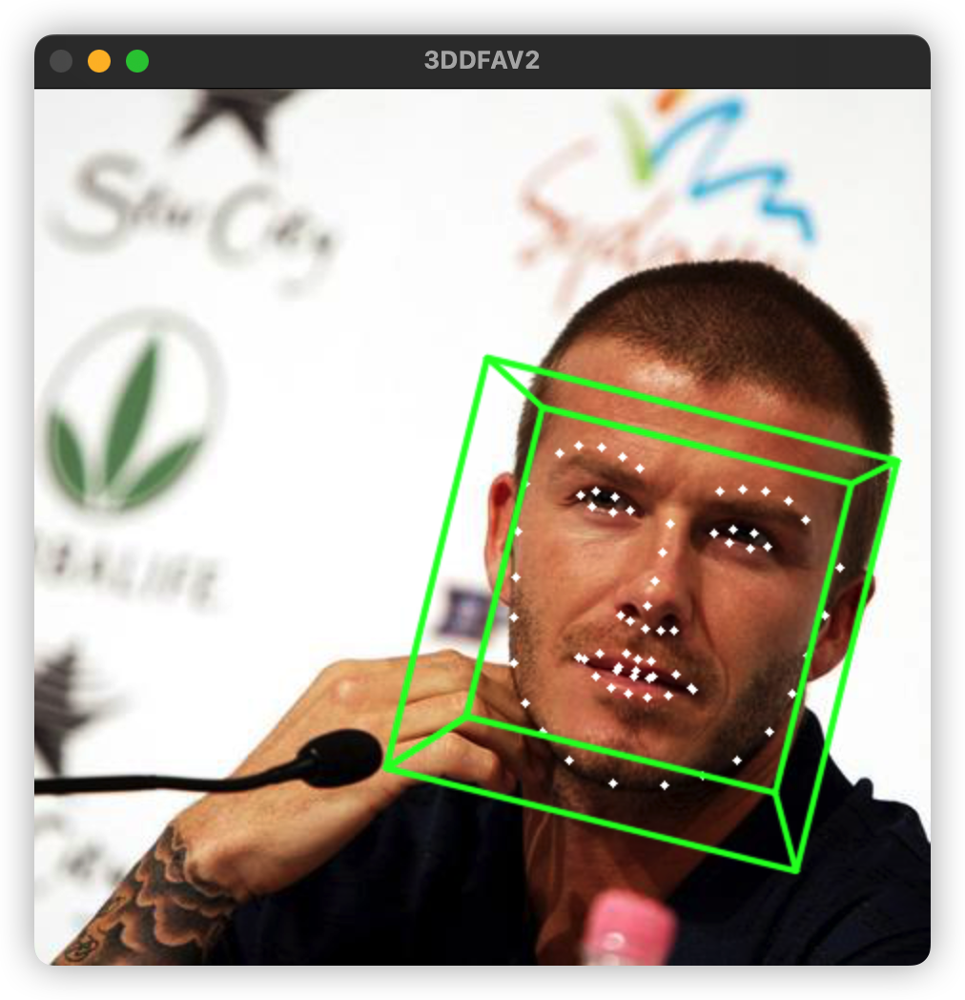

<p align="center">
 
<p align="center">


## Introduction

AIDB的目的是使用c++快速AI模型，集成了目前市面上比较主流的几个c++部署框架，包括ONNX、MNN、NCNN、TNN、Paddle和OpenVINO。将几个框架抽象成统一的接口，通过配置文件可以方便调用不同框架和模型。
并且提供了很多预训练模型供调用测试，涉及目标检测、分类和生成模型。

_持续更新ing_


## Model List

| Model name             | Model Type         | Pretrained From                                                             | ONNX                                                                                                                                                       | MNN                                                                                                                                                         | NCNN                                                                                                                                     | OpenVINO                                                                                                                                 | TNN                                                                                                                                      |  Paddle Lite                                                                                                                                                | Demo              |
| :--------------------: | :----------------: | :-------------------------------------------------------------------------: | :--------------------------------------------------------------------------------------------------------------------------------------------------------: | :---------------------------------------------------------------------------------------------------------------------------------------------------------: | :--------------------------------------------------------------------------------------------------------------------------------------: | :--------------------------------------------------------------------------------------------------------------------------------------: | :--------------------------------------------------------------------------------------------------------------------------------------: | :---------------------------------------------------------------------------------------------------------------------------------------------------------: | :---------------: |
| SCRFD_10G_WITH_KPS     | Face Detection     | [insightface](https://github.com/deepinsight/insightface)                   | [MEGA](https://mega.nz/file/NDF2jBxT#7HYmZLkql7wJSzLU3Uyt34yZ5cYK6VeqP7PuPkmqa-w) & [Baidu[prv3]](https://pan.baidu.com/s/14v6CAtO31dPK4q5ywIwcfQ?pwd=prv3)| [MEGA](https://mega.nz/file/9ftwHDzI#ufJDLTnYz1YvyOYgXdhFxOq4mMZj7txaqXJDTOmDCRs) & [Baidu[2sew]](https://pan.baidu.com/s/19WXUPHc5FZwZf17OJLJqAA?pwd=2sew) | [MEGA](https://mega.nz/folder/VS12kKaQ#WiSWaDs9wdxuePYkcF4fdQ) & [Baidu[tpxe]](https://pan.baidu.com/s/1aWFnhDtmCZuwToYCAC1fXg?pwd=tpxe) | [MEGA](https://mega.nz/folder/BTkSVCKQ#RC5D3lmYXEpk329A5CPWNA) & [Baidu[m4u5]](https://pan.baidu.com/s/1Zdkx_vMNowRHav9Gf24vOA?pwd=m4u5) | [MEGA](https://mega.nz/folder/1CkmiZLA#hPiYFMjz2OHzuyIqpdnWng) & [Baidu[7ch9]](https://pan.baidu.com/s/1I1jglS1CYbUgqU8ljiJgdQ?pwd=7ch9) | [MEGA](https://mega.nz/file/ETd0XATY#dwhORAAkeu_CgIvDE083CRrlTvLKDTYd8apeRDPbQQw) & [Baidu[75u6]](https://pan.baidu.com/s/1E0kqSnOG3osdjFC6uYtufw?pwd=75u6) | <p align="center">  <p align="center"> | 
| SCRFD_2.5G_WITH_KPS    | Face Detection     | [insightface](https://github.com/deepinsight/insightface)                   | [MEGA](https://mega.nz/file/lfUTXDqI#KtYlslJe4DkvuYxHaGaTV-v29fMJ_NBNVemtZiCHSQU) & [Baidu[prv3]](https://pan.baidu.com/s/14v6CAtO31dPK4q5ywIwcfQ?pwd=prv3)| [MEGA](https://mega.nz/file/MGtjQY6D#nxQ7rg-IdBORy64vAhfdpPi7FHX6_GT1GiX_ezpKstE) & [Baidu[2sew]](https://pan.baidu.com/s/19WXUPHc5FZwZf17OJLJqAA?pwd=2sew) | [MEGA](https://mega.nz/folder/VS12kKaQ#WiSWaDs9wdxuePYkcF4fdQ) & [Baidu[tpxe]](https://pan.baidu.com/s/1aWFnhDtmCZuwToYCAC1fXg?pwd=tpxe) | [MEGA](https://mega.nz/folder/BTkSVCKQ#RC5D3lmYXEpk329A5CPWNA) & [Baidu[m4u5]](https://pan.baidu.com/s/1Zdkx_vMNowRHav9Gf24vOA?pwd=m4u5) | [MEGA](https://mega.nz/folder/1CkmiZLA#hPiYFMjz2OHzuyIqpdnWng) & [Baidu[7ch9]](https://pan.baidu.com/s/1I1jglS1CYbUgqU8ljiJgdQ?pwd=7ch9) | [MEGA](https://mega.nz/file/wLVlnBpT#x9Ah7p7XCsn4o6-bgzX1nFQmlDnB-L7zayOCbz23bcw) & [Baidu[75u6]](https://pan.baidu.com/s/1E0kqSnOG3osdjFC6uYtufw?pwd=75u6) | <p align="center">  <p align="center"> |
| SCRFD_500M_WITH_KPS    | Face Detection     | [insightface](https://github.com/deepinsight/insightface)                   | [MEGA](https://mega.nz/file/oe10zQKJ#kxFAOKhJjWVH9uVgYLgzvlL5PWjy62KTOZkjs842l-k) & [Baidu[prv3]](https://pan.baidu.com/s/14v6CAtO31dPK4q5ywIwcfQ?pwd=prv3)| [MEGA](https://mega.nz/file/gDc0DDxB#eIqVGnmjFPcklALjBB9baNVz_vJIxueauRL5hSkaZCo) & [Baidu[2sew]](https://pan.baidu.com/s/19WXUPHc5FZwZf17OJLJqAA?pwd=2sew) | [MEGA](https://mega.nz/folder/VS12kKaQ#WiSWaDs9wdxuePYkcF4fdQ) & [Baidu[tpxe]](https://pan.baidu.com/s/1aWFnhDtmCZuwToYCAC1fXg?pwd=tpxe) | [MEGA](https://mega.nz/folder/BTkSVCKQ#RC5D3lmYXEpk329A5CPWNA) & [Baidu[m4u5]](https://pan.baidu.com/s/1Zdkx_vMNowRHav9Gf24vOA?pwd=m4u5) | [MEGA](https://mega.nz/folder/1CkmiZLA#hPiYFMjz2OHzuyIqpdnWng) & [Baidu[7ch9]](https://pan.baidu.com/s/1I1jglS1CYbUgqU8ljiJgdQ?pwd=7ch9) | [MEGA](https://mega.nz/file/APciBa6B#BeNh_e9yJUOZcsAi0FNOYXXigNLoAm-m6BCBWYq5wNo) & [Baidu[75u6]](https://pan.baidu.com/s/1E0kqSnOG3osdjFC6uYtufw?pwd=75u6) | ⬆️                                                                                                   | 
| PFPLD                  | Face Landmark      | [nniefacelib](https://github.com/hanson-young/nniefacelib)                  | [MEGA](https://mega.nz/file/MPk30bTY#SIkRKdQrdkFeJj_JeZwe29J7c4rj3hgORGDkmeLeeUk) & [Baidu[kufx]](https://pan.baidu.com/s/15GKA_Qhqi9883J79Z5PSwQ?pwd=kufx)| [MEGA](https://mega.nz/file/VD1mTR7L#EXhUuOavI2aAVEfSX-0vKdTEMMM6iYDzIgxKpghPR80) & [Baidu[eciw]](https://pan.baidu.com/s/1_5GewNxGfxgxZszGkHk9pA?pwd=eciw) | [MEGA](https://mega.nz/folder/YHNw2Z5Y#oyQW_zbCjbmGwJULAXaIWg) & [Baidu[59jw]](https://pan.baidu.com/s/1nTBECLYB6oSuBhxO5k40XA?pwd=59jw) | [MEGA](https://mega.nz/folder/JW1GwKLR#LSPIUrNmtx38tiJcT4iKKQ) & [Baidu[w6e7]](https://pan.baidu.com/s/1-fctNmfeFUCkOH7s1b9UjA?pwd=w6e7) | [MEGA](https://mega.nz/folder/lGthRSLC#N-isKjbP8DuVgvjM8aD57A) & [Baidu[d8qh]](https://pan.baidu.com/s/1Z6vyBbDolqWxfOIgUh7v_w?pwd=d8qh) | [MEGA](https://mega.nz/file/wbVj3K4D#hhAl-xdSInnY-M3VQ9YZPaNrAONEeWt7OEabiq4qudQ) & [Baidu[xeni]](https://pan.baidu.com/s/10_4tDrPm0gi6nQd9HyiK-w?pwd=xeni) | <p align="center">  <p align="center"> |
| BISENET                | Face Parsing       | [face-parsing.PyTorch](https://github.com/zllrunning/face-parsing.PyTorch)  | [MEGA](https://mega.nz/file/QG0zWLKI#-ToRvdqsETrybT_O6M8HHiPbBSWSdxs0V0aZnkvm440) & [Baidu[7hqw]](https://pan.baidu.com/s/1r7wzzNX4qaMYAlgtAJcitg?pwd=7hqw)| [MEGA](https://mega.nz/file/1CF2VJZa#6HKDqaTOZlnuVZoEBqhhYdI-1jXdBLHGdQ8pNXQfeZ4) & [Baidu[rm5b]](https://pan.baidu.com/s/1OC_9_na4Pb0TVpv9fUawfg?pwd=rm5b) | [MEGA](https://mega.nz/folder/MGUwlDrZ#7NPLp1XLq6caSm1fMymkBQ) & [Baidu[wx59]](https://pan.baidu.com/s/1d6bg03iKlKKzBQ8ywlytVg?pwd=wx59) | [MEGA](https://mega.nz/folder/0esxxJDJ#EbiR2tz4mh5PgOhHcWLgMQ) & [Baidu[mcdi]](https://pan.baidu.com/s/1CMWlGdRi4B_XHOaIVoM7SA?pwd=mcdi) | [MEGA](https://mega.nz/folder/Yb8zEL7D#z8qMp988-bviJTdSJQGGzw) & [Baidu[vwj9]](https://pan.baidu.com/s/1lidXWFHyZ8J8LLcfuuwmwg?pwd=vwj9) | [MEGA](https://mega.nz/file/tDlR3Aqb#es-QB9Pj2pXhPX-B1w4WJrHs23ovFRQhp9GU_zDpI0Q) & [Baidu[xzwk]](https://pan.baidu.com/s/1kWLI73hFc6sUnZqYDMwGfw?pwd=xzwk) | <p align="center">  <p align="center"> | 
| 3DDFAV2_MB1_BASE       | Face 3D            | [3DDFA_V2](https://github.com/cleardusk/3DDFA_V2)                           | [MEGA](https://mega.nz/file/lDlxnSQD#BdIBoSkIT8n6FwU-tRd2uQQqC3vwkeJmbyANv7ijYBY) & [Baidu[ccei]](https://pan.baidu.com/s/1m1Qd28Q3wev5KCx8_WeE8w?pwd=ccei)| [MEGA](https://mega.nz/file/cS1lzB5K#QWyMxy81FKjP29gxbB52F5xs-oSBgxfrrWr_kIWkyAw) & [Baidu[nrrx]](https://pan.baidu.com/s/1bPKNZJNHQfWXMEE5d422wA?pwd=nrrx) | [MEGA](https://mega.nz/folder/VKFwEYaK#DwIpKc6sW3Cr52TsxzQozQ) & [Baidu[mqps]](https://pan.baidu.com/s/1OFkK0Q6e7lFgRLSp2uhyDQ?pwd=mqps) | [MEGA](https://mega.nz/folder/9K8yzQwa#Vn6nsXtdzG_5FViny7URUg) & [Baidu[ydtb]](https://pan.baidu.com/s/1WesdxJ1B7IyLByhBefcCPg?pwd=ydtb) | [MEGA](https://mega.nz/folder/VDF0FBjC#LxPAdtTvr5c6z61LM8NR8Q) & [Baidu[rrgv]](https://pan.baidu.com/s/1W1adLHQxvxvU8iCGnig7Og?pwd=rrgv) | [MEGA](https://mega.nz/file/BOUD0axA#24YT7K1mX_oQj-bs_kpjmeYHyKutL0DQyVn4tOXdwf0) & [Baidu[fkvc]](https://pan.baidu.com/s/1oZhMlj5fOIvEbJT6fjIOIA?pwd=fkvc) | <p align="center">  <p align="center"> |
| 3DDFAV2_MB1_DENSE      | Face 3D            | [3DDFA_V2](https://github.com/cleardusk/3DDFA_V2)                           | [MEGA](https://mega.nz/file/oeNkBSjS#mo2khCeg97yJqqw_7zZ4FKSeyR7nOoWa6V1Ku5j0Cgc) & [Baidu[ccei]](https://pan.baidu.com/s/1m1Qd28Q3wev5KCx8_WeE8w?pwd=ccei)| [MEGA](https://mega.nz/file/tK0xlIpS#yv_XupxAGj36ulQzJ00TVL_wbQxc2Ikf3CKmsh4J6n4) & [Baidu[nrrx]](https://pan.baidu.com/s/1bPKNZJNHQfWXMEE5d422wA?pwd=nrrx) | [MEGA](https://mega.nz/folder/VKFwEYaK#DwIpKc6sW3Cr52TsxzQozQ) & [Baidu[mqps]](https://pan.baidu.com/s/1OFkK0Q6e7lFgRLSp2uhyDQ?pwd=mqps) | [MEGA](https://mega.nz/folder/9K8yzQwa#Vn6nsXtdzG_5FViny7URUg) & [Baidu[ydtb]](https://pan.baidu.com/s/1WesdxJ1B7IyLByhBefcCPg?pwd=ydtb) | [MEGA](https://mega.nz/folder/VDF0FBjC#LxPAdtTvr5c6z61LM8NR8Q) & [Baidu[rrgv]](https://pan.baidu.com/s/1W1adLHQxvxvU8iCGnig7Og?pwd=rrgv) | [MEGA](https://mega.nz/file/cDV1TTAY#ivUU82rQycRqjgaqkA_7vTCqG3jQDyQQiooXVuEXipE) & [Baidu[fkvc]](https://pan.baidu.com/s/1oZhMlj5fOIvEbJT6fjIOIA?pwd=fkvc) | <p align="center">  <p align="center"> |
| 3DDFAV2_MB05_BASE      | Face 3D            | [3DDFA_V2](https://github.com/cleardusk/3DDFA_V2)                           | [MEGA](https://mega.nz/file/ZbVlxB7R#GR-8rpjrlilQMQaj1_BA04VeC8fZz99GBjFrYWbIUBg) & [Baidu[ccei]](https://pan.baidu.com/s/1m1Qd28Q3wev5KCx8_WeE8w?pwd=ccei)| [MEGA](https://mega.nz/file/1OFmyQJK#2DufXiioIp1XOqezJAdoKxxk361LXI-dyGHWGf92yis) & [Baidu[nrrx]](https://pan.baidu.com/s/1bPKNZJNHQfWXMEE5d422wA?pwd=nrrx) | [MEGA](https://mega.nz/folder/VKFwEYaK#DwIpKc6sW3Cr52TsxzQozQ) & [Baidu[mqps]](https://pan.baidu.com/s/1OFkK0Q6e7lFgRLSp2uhyDQ?pwd=mqps) | [MEGA](https://mega.nz/folder/9K8yzQwa#Vn6nsXtdzG_5FViny7URUg) & [Baidu[ydtb]](https://pan.baidu.com/s/1WesdxJ1B7IyLByhBefcCPg?pwd=ydtb) | [MEGA](https://mega.nz/folder/VDF0FBjC#LxPAdtTvr5c6z61LM8NR8Q) & [Baidu[rrgv]](https://pan.baidu.com/s/1W1adLHQxvxvU8iCGnig7Og?pwd=rrgv) | [MEGA](https://mega.nz/file/QDEjDCKT#1KeWQ8XdnySU2K41Hb5fRZwZbYdDN60DDGhFIH_1zMY) & [Baidu[fkvc]](https://pan.baidu.com/s/1oZhMlj5fOIvEbJT6fjIOIA?pwd=fkvc) | <p align="center">  <p align="center"> | 
| 3DDFAV2_MB05_DENSE     | Face 3D            | [3DDFA_V2](https://github.com/cleardusk/3DDFA_V2)                           | [MEGA](https://mega.nz/file/oC9jEDYY#mW-5lBGWDJtTUqJCjpJz2mHqKMO9EKZyopWPJCzRfuI) & [Baidu[ccei]](https://pan.baidu.com/s/1m1Qd28Q3wev5KCx8_WeE8w?pwd=ccei)| [MEGA](https://mega.nz/file/hHUynBjS#OepI0lpb83VwuDEXz-jUG17Xunfr48GPpQVtnOIoJRo) & [Baidu[nrrx]](https://pan.baidu.com/s/1bPKNZJNHQfWXMEE5d422wA?pwd=nrrx) | [MEGA](https://mega.nz/folder/VKFwEYaK#DwIpKc6sW3Cr52TsxzQozQ) & [Baidu[mqps]](https://pan.baidu.com/s/1OFkK0Q6e7lFgRLSp2uhyDQ?pwd=mqps) | [MEGA](https://mega.nz/folder/9K8yzQwa#Vn6nsXtdzG_5FViny7URUg) & [Baidu[ydtb]](https://pan.baidu.com/s/1WesdxJ1B7IyLByhBefcCPg?pwd=ydtb) | [MEGA](https://mega.nz/folder/VDF0FBjC#LxPAdtTvr5c6z61LM8NR8Q) & [Baidu[rrgv]](https://pan.baidu.com/s/1W1adLHQxvxvU8iCGnig7Og?pwd=rrgv) | [MEGA](https://mega.nz/file/QX1HEbDA#HN60g_W9FInaIKiy_8yK5G2W4RIenhW_7bRpSXupAkg) & [Baidu[fkvc]](https://pan.baidu.com/s/1oZhMlj5fOIvEbJT6fjIOIA?pwd=fkvc) | <p align="center">  <p align="center"> | 
| YOLOX_TINY             | Object Detection   | [YOLOX](https://github.com/Megvii-BaseDetection/YOLOX)                      | [MEGA](https://mega.nz/file/wO9EEaYZ#HdSGsBkueX5HHsP-vHUjRIUvRmsjq3TM5-oNWbXEjNc) & [Baidu[vuwe]](https://pan.baidu.com/s/1gR5p-NaSaDHh2C37B_QX7w?pwd=vuwe)| [MEGA](https://mega.nz/file/MWl2lBga#HIojm7-2K_3ExOC0jIw8x7p1cmA5nuXSeuX6SPyCtiQ) & [Baidu[xf8g]](https://pan.baidu.com/s/1WXpyiaJejCVlEGFL7KePyQ?pwd=xf8g) | [MEGA](https://mega.nz/folder/wetkDZ7K#uO5BlINCuTxCNQTDa4fBcw) & [Baidu[tix9]](https://pan.baidu.com/s/1Iw_8mkCxU91QrEY5Z4aSdw?pwd=tix9) | [MEGA](https://mega.nz/folder/JaNQlRIL#G1jHO80uJYlBBhhQSdTbNg) & [Baidu[3eij]](https://pan.baidu.com/s/1CGUg1NdRE3PpQ9Es_uv4-w?pwd=3eij) | [MEGA](https://mega.nz/folder/9PtT3aaT#p9MQHwGm-NFo4w29PCsPhA) & [Baidu[4n7z]](https://pan.baidu.com/s/19tTiT4Dh_X-XkBeozrW75g?pwd=4n7z) | [MEGA](https://mega.nz/file/ZPFSRKia#zWt_hb1kdKZfzRDZXHQ-WXxbSqvE6wi_obCvdd6wEHU) & [Baidu[vd8x]](https://pan.baidu.com/s/1B46wr2r7P13hlYzlijLxdg?pwd=vd8x) | <p align="center">  <p align="center"> | 
| YOLOX_NANO             | Object Detection   | [YOLOX](https://github.com/Megvii-BaseDetection/YOLOX)                      | [MEGA](https://mega.nz/file/hCNBQZ7K#H5cGxi0pT8b9x2S7U27EGk39NDTX-ruFsfz0IcF57HE) & [Baidu[vuwe]](https://pan.baidu.com/s/1gR5p-NaSaDHh2C37B_QX7w?pwd=vuwe)| [MEGA](https://mega.nz/file/1KsiRYia#RRVjD6Usm7JbtqMseC1-6LazE19YYAF9krThkh4sGHU) & [Baidu[xf8g]](https://pan.baidu.com/s/1WXpyiaJejCVlEGFL7KePyQ?pwd=xf8g) | [MEGA](https://mega.nz/folder/wetkDZ7K#uO5BlINCuTxCNQTDa4fBcw) & [Baidu[tix9]](https://pan.baidu.com/s/1Iw_8mkCxU91QrEY5Z4aSdw?pwd=tix9) | [MEGA](https://mega.nz/folder/JaNQlRIL#G1jHO80uJYlBBhhQSdTbNg) & [Baidu[3eij]](https://pan.baidu.com/s/1CGUg1NdRE3PpQ9Es_uv4-w?pwd=3eij) | [MEGA](https://mega.nz/folder/9PtT3aaT#p9MQHwGm-NFo4w29PCsPhA) & [Baidu[4n7z]](https://pan.baidu.com/s/19tTiT4Dh_X-XkBeozrW75g?pwd=4n7z) | [MEGA](https://mega.nz/file/ADF3EZhI#bYiTtcG_6F_HYyOZP3atM4RPEETq10c1GvD6L6Wi-Ec) & [Baidu[vd8x]](https://pan.baidu.com/s/1B46wr2r7P13hlYzlijLxdg?pwd=vd8x) | <p align="center">  <p align="center"> | 
| YOLOX_S                | Object Detection   | [YOLOX](https://github.com/Megvii-BaseDetection/YOLOX)                      | [MEGA](https://mega.nz/file/JHUBhRqI#ewelF9N-6N6Slrf5DNqIy1gOUxB3iLrz-Aklje4zNVc) & [Baidu[vuwe]](https://pan.baidu.com/s/1gR5p-NaSaDHh2C37B_QX7w?pwd=vuwe)| [MEGA](https://mega.nz/file/xasBzRjD#-Laeb-7gY5yEaxs9taxIhdf8_4u8QxHElY1mJ6g3aRk) & [Baidu[xf8g]](https://pan.baidu.com/s/1WXpyiaJejCVlEGFL7KePyQ?pwd=xf8g) | [MEGA](https://mega.nz/folder/wetkDZ7K#uO5BlINCuTxCNQTDa4fBcw) & [Baidu[tix9]](https://pan.baidu.com/s/1Iw_8mkCxU91QrEY5Z4aSdw?pwd=tix9) | [MEGA](https://mega.nz/folder/JaNQlRIL#G1jHO80uJYlBBhhQSdTbNg) & [Baidu[3eij]](https://pan.baidu.com/s/1CGUg1NdRE3PpQ9Es_uv4-w?pwd=3eij) | [MEGA](https://mega.nz/folder/9PtT3aaT#p9MQHwGm-NFo4w29PCsPhA) & [Baidu[4n7z]](https://pan.baidu.com/s/19tTiT4Dh_X-XkBeozrW75g?pwd=4n7z) | [MEGA](https://mega.nz/file/wLd30RiI#FTbuH_CAaEQ3Bkx3zR58qxsE7DofGj_NhsvkCc0ZgHU) & [Baidu[vd8x]](https://pan.baidu.com/s/1B46wr2r7P13hlYzlijLxdg?pwd=vd8x) | ⬆️ | 
| YOLOX_M                | Object Detection   | [YOLOX](https://github.com/Megvii-BaseDetection/YOLOX)                      | [MEGA](https://mega.nz/file/oX9FzILR#obnD91Gs-6vuyExtb1xAPwZLwpiY1kP30JaU5na0eDI) & [Baidu[vuwe]](https://pan.baidu.com/s/1gR5p-NaSaDHh2C37B_QX7w?pwd=vuwe)| [MEGA](https://mega.nz/file/lOcUQLBI#B3nXtBb5L85DfBza1vkvq62GMO4iGQ527sUnv-TmqhU) & [Baidu[xf8g]](https://pan.baidu.com/s/1WXpyiaJejCVlEGFL7KePyQ?pwd=xf8g) | [MEGA](https://mega.nz/folder/wetkDZ7K#uO5BlINCuTxCNQTDa4fBcw) & [Baidu[tix9]](https://pan.baidu.com/s/1Iw_8mkCxU91QrEY5Z4aSdw?pwd=tix9) | [MEGA](https://mega.nz/folder/JaNQlRIL#G1jHO80uJYlBBhhQSdTbNg) & [Baidu[3eij]](https://pan.baidu.com/s/1CGUg1NdRE3PpQ9Es_uv4-w?pwd=3eij) | [MEGA](https://mega.nz/folder/9PtT3aaT#p9MQHwGm-NFo4w29PCsPhA) & [Baidu[4n7z]](https://pan.baidu.com/s/19tTiT4Dh_X-XkBeozrW75g?pwd=4n7z) | [MEGA](https://mega.nz/file/EPFiXLoQ#AoabJ5QyAxyraiPNso0ePrX0lG6eV5WhoLkfacqJ0es) & [Baidu[vd8x]](https://pan.baidu.com/s/1B46wr2r7P13hlYzlijLxdg?pwd=vd8x) | ⬆️ |
| YOLOX_L                | Object Detection   | [YOLOX](https://github.com/Megvii-BaseDetection/YOLOX)                      | [MEGA](https://mega.nz/file/tb0RnTrT#H8j3GPP0mB_3qtKclWUhwRu1CsLtDx47cxGJuK8apHw) & [Baidu[vuwe]](https://pan.baidu.com/s/1gR5p-NaSaDHh2C37B_QX7w?pwd=vuwe)| [MEGA](https://mega.nz/file/MGUn1LyY#yqilyRdKcUqtW996cZXpwjX5GcYtVLh2Np4Qrcl3xEU) & [Baidu[xf8g]](https://pan.baidu.com/s/1WXpyiaJejCVlEGFL7KePyQ?pwd=xf8g) | [MEGA](https://mega.nz/folder/wetkDZ7K#uO5BlINCuTxCNQTDa4fBcw) & [Baidu[tix9]](https://pan.baidu.com/s/1Iw_8mkCxU91QrEY5Z4aSdw?pwd=tix9) | [MEGA](https://mega.nz/folder/JaNQlRIL#G1jHO80uJYlBBhhQSdTbNg) & [Baidu[3eij]](https://pan.baidu.com/s/1CGUg1NdRE3PpQ9Es_uv4-w?pwd=3eij) | [MEGA](https://mega.nz/folder/9PtT3aaT#p9MQHwGm-NFo4w29PCsPhA) & [Baidu[4n7z]](https://pan.baidu.com/s/19tTiT4Dh_X-XkBeozrW75g?pwd=4n7z) | [MEGA](https://mega.nz/file/te0zhBLQ#teHI51AAIeDMAwBDbD6CIlxRlSLB-pxxccGMy25h3LA) & [Baidu[vd8x]](https://pan.baidu.com/s/1B46wr2r7P13hlYzlijLxdg?pwd=vd8x) | ⬆️ |
| YOLOX_X                | Object Detection   | [YOLOX](https://github.com/Megvii-BaseDetection/YOLOX)                      | [MEGA](https://mega.nz/file/pW9E0Rwa#tHGbzUcfT_Aia3y-bEvOXUw5ya4zLhullGkDLLEUoP8) & [Baidu[vuwe]](https://pan.baidu.com/s/1gR5p-NaSaDHh2C37B_QX7w?pwd=vuwe)| [MEGA](https://mega.nz/file/dPU1XBTI#Q4izc-msmk2bGEHhWSySjMK5IF5T_g5_1WstcNn7kDQ) & [Baidu[xf8g]](https://pan.baidu.com/s/1WXpyiaJejCVlEGFL7KePyQ?pwd=xf8g) | [MEGA](https://mega.nz/folder/wetkDZ7K#uO5BlINCuTxCNQTDa4fBcw) & [Baidu[tix9]](https://pan.baidu.com/s/1Iw_8mkCxU91QrEY5Z4aSdw?pwd=tix9) | [MEGA](https://mega.nz/folder/JaNQlRIL#G1jHO80uJYlBBhhQSdTbNg) & [Baidu[3eij]](https://pan.baidu.com/s/1CGUg1NdRE3PpQ9Es_uv4-w?pwd=3eij) | [MEGA](https://mega.nz/folder/9PtT3aaT#p9MQHwGm-NFo4w29PCsPhA) & [Baidu[4n7z]](https://pan.baidu.com/s/19tTiT4Dh_X-XkBeozrW75g?pwd=4n7z) | [MEGA](https://mega.nz/file/IHdAgbQJ#2n6kO14zSa0fLD8Z0mNSXt9w1GWCsUBBHKlmm7J-NHA) & [Baidu[vd8x]](https://pan.baidu.com/s/1B46wr2r7P13hlYzlijLxdg?pwd=vd8x) | ⬆️ | 
| YOLOX_DARKNET          | Object Detection   | [YOLOX](https://github.com/Megvii-BaseDetection/YOLOX)                      | [MEGA](https://mega.nz/file/0TEDGZIQ#YSaznSNzgRXU9m8UqZXUZLqbDlennXH53-tQsiv8qqM) & [Baidu[vuwe]](https://pan.baidu.com/s/1gR5p-NaSaDHh2C37B_QX7w?pwd=vuwe)| [MEGA](https://mega.nz/file/YOcG1IbI#CPDHoESpJpC_aIIwut2C72t3gj4CMff6HD0ryguQ1Jc) & [Baidu[xf8g]](https://pan.baidu.com/s/1WXpyiaJejCVlEGFL7KePyQ?pwd=xf8g) | [MEGA](https://mega.nz/folder/wetkDZ7K#uO5BlINCuTxCNQTDa4fBcw) & [Baidu[tix9]](https://pan.baidu.com/s/1Iw_8mkCxU91QrEY5Z4aSdw?pwd=tix9) | [MEGA](https://mega.nz/folder/JaNQlRIL#G1jHO80uJYlBBhhQSdTbNg) & [Baidu[3eij]](https://pan.baidu.com/s/1CGUg1NdRE3PpQ9Es_uv4-w?pwd=3eij) | [MEGA](https://mega.nz/folder/9PtT3aaT#p9MQHwGm-NFo4w29PCsPhA) & [Baidu[4n7z]](https://pan.baidu.com/s/19tTiT4Dh_X-XkBeozrW75g?pwd=4n7z) | [MEGA](https://mega.nz/file/hK1WUZAD#xOBQgn_RP-wplv7RlfML1ZKXkf0RfT9zuhAFmqDbTI4) & [Baidu[vd8x]](https://pan.baidu.com/s/1B46wr2r7P13hlYzlijLxdg?pwd=vd8x) | ⬆️ | 
| YOLOV7_TINY            | Object Detection   | [yolov7](https://github.com/WongKinYiu/yolov7)                              | [MEGA](https://mega.nz/file/MK8DnZSC#NoY14-2cGs45zC5RbQsBoQT-K4YC2i2_VdHDIgWHURs) & [Baidu[uax8]](https://pan.baidu.com/s/1pmk4UPNUv-JqvuwkGT1_FA?pwd=uax8)| [MEGA](https://mega.nz/file/ECkUDLgD#zPlZh_THdG6YUAs0dvGuv55jiPyZtQ1xcmQ501wc9d0) & [Baidu[s7qm]](https://pan.baidu.com/s/1gOchiBMNLgILXOXaQd4wmQ?pwd=s7qm) | [MEGA](https://mega.nz/folder/wWtF1QBZ#KIG1k9GAJWPGK1dpxKkqWA) & [Baidu[nzun]](https://pan.baidu.com/s/1Lh-uAKgh4PKoaOQfdslUTg?pwd=nzun) | [MEGA](https://mega.nz/folder/ZecHSLAY#1skWPuf8vvv0audhPx_jiw) & [Baidu[4dmi]](https://pan.baidu.com/s/1Trud5pfpMKbH-ADx0_IVtA?pwd=4dmi) | [MEGA](https://mega.nz/folder/FCdhEa7a#xKaS8uTYuwMsHEhRfmG0rg) & [Baidu[5y8d]](https://pan.baidu.com/s/1tq87cWflBPqaaqwCKklzMA?pwd=5y8d) | [MEGA](https://mega.nz/file/USFWxSyC#6ndJx1kEx4FiUkmb3H3ZFnez3OOE3DmKr06x4er6P-8) & [Baidu[c5d5]](https://pan.baidu.com/s/1U0eHveqj4lBjepQgqkvuzA?pwd=c5d5) | <p align="center">  <p align="center"> | 
| YOLOV7_TINY_GRID       | Object Detection   | [yolov7](https://github.com/WongKinYiu/yolov7)                              | [MEGA](https://mega.nz/file/9O01iYra#-aWvZn-7VvEdBTNaegdEANpulrf3hL5t3quAVPM5EG0) & [Baidu[uax8]](https://pan.baidu.com/s/1pmk4UPNUv-JqvuwkGT1_FA?pwd=uax8)| [MEGA](https://mega.nz/file/5bMmgK7Q#PLs-Z-7x7c2Dy0wdB3s5FqH3IDB8xE6DM0BvHbgWGlU) & [Baidu[s7qm]](https://pan.baidu.com/s/1gOchiBMNLgILXOXaQd4wmQ?pwd=s7qm) | ❎                                                                                                                                       | [MEGA](https://mega.nz/folder/ZecHSLAY#1skWPuf8vvv0audhPx_jiw) & [Baidu[4dmi]](https://pan.baidu.com/s/1Trud5pfpMKbH-ADx0_IVtA?pwd=4dmi) | [MEGA](https://mega.nz/folder/FCdhEa7a#xKaS8uTYuwMsHEhRfmG0rg) & [Baidu[5y8d]](https://pan.baidu.com/s/1tq87cWflBPqaaqwCKklzMA?pwd=5y8d) | [MEGA](https://mega.nz/file/RONC0IQB#Kjl5zGM7v2DQNNkRq-uAaKICWagkilF184eOvMj6ofs) & [Baidu[c5d5]](https://pan.baidu.com/s/1U0eHveqj4lBjepQgqkvuzA?pwd=c5d5) | <p align="center">  <p align="center"> | 
| YOLOV7                 | Object Detection   | [yolov7](https://github.com/WongKinYiu/yolov7)                              | [MEGA](https://mega.nz/file/dH0CFY4J#s1JXFyYwHhXBKE7Kl4T5LGUDzMr7U33_yGSH4G3kwAM) & [Baidu[uax8]](https://pan.baidu.com/s/1pmk4UPNUv-JqvuwkGT1_FA?pwd=uax8)| [MEGA](https://mega.nz/file/5LVW2YKS#W1aXwxFyZCQHE8nx3lE62Z81DtI1-ZBPn1PXbzK9UQc) & [Baidu[s7qm]](https://pan.baidu.com/s/1gOchiBMNLgILXOXaQd4wmQ?pwd=s7qm) | [MEGA](https://mega.nz/folder/wWtF1QBZ#KIG1k9GAJWPGK1dpxKkqWA) & [Baidu[nzun]](https://pan.baidu.com/s/1Lh-uAKgh4PKoaOQfdslUTg?pwd=nzun) | [MEGA](https://mega.nz/folder/ZecHSLAY#1skWPuf8vvv0audhPx_jiw) & [Baidu[4dmi]](https://pan.baidu.com/s/1Trud5pfpMKbH-ADx0_IVtA?pwd=4dmi) | [MEGA](https://mega.nz/folder/FCdhEa7a#xKaS8uTYuwMsHEhRfmG0rg) & [Baidu[5y8d]](https://pan.baidu.com/s/1tq87cWflBPqaaqwCKklzMA?pwd=5y8d) | [MEGA](https://mega.nz/file/oGNwHQyL#XITjSiGQBmSwMVAe5QLACMl4TzO1z8mGmdgO1AGQ-YU) & [Baidu[c5d5]](https://pan.baidu.com/s/1U0eHveqj4lBjepQgqkvuzA?pwd=c5d5) | ⬆️ |
| YOLOV7_GRID            | Object Detection   | [yolov7](https://github.com/WongKinYiu/yolov7)                              | [MEGA](https://mega.nz/file/5S931Dya#lBW4DQ5RnTxYDAIyzja9BE-B1PHY4o820j5TZ2svgKA) & [Baidu[uax8]](https://pan.baidu.com/s/1pmk4UPNUv-JqvuwkGT1_FA?pwd=uax8)| [MEGA](https://mega.nz/file/4f1SgJpJ#7N2C5Ul5xyFjti9gqHr3wm0G1C9kkJGPWg09kp2aUKE) & [Baidu[s7qm]](https://pan.baidu.com/s/1gOchiBMNLgILXOXaQd4wmQ?pwd=s7qm) | ❎                                                                                                                                       | [MEGA](https://mega.nz/folder/ZecHSLAY#1skWPuf8vvv0audhPx_jiw) & [Baidu[4dmi]](https://pan.baidu.com/s/1Trud5pfpMKbH-ADx0_IVtA?pwd=4dmi) | [MEGA](https://mega.nz/folder/FCdhEa7a#xKaS8uTYuwMsHEhRfmG0rg) & [Baidu[5y8d]](https://pan.baidu.com/s/1tq87cWflBPqaaqwCKklzMA?pwd=5y8d) | [MEGA](https://mega.nz/file/RP0yBDzJ#sTwfJWamLIA-XZinJlue8AUUzhcR5sSr7agsN6nuztE) & [Baidu[c5d5]](https://pan.baidu.com/s/1U0eHveqj4lBjepQgqkvuzA?pwd=c5d5) | ⬆️ |
| YOLOV7X                | Object Detection   | [yolov7](https://github.com/WongKinYiu/yolov7)                              | [MEGA](https://mega.nz/file/8SFVxZZa#x87UxFRIl9n4wIL4UQ02GGJOJm8eN_xVzj7BbIoBQ5k) & [Baidu[uax8]](https://pan.baidu.com/s/1pmk4UPNUv-JqvuwkGT1_FA?pwd=uax8)| [MEGA](https://mega.nz/file/cHEzEaRT#jXg_8LY6sQVqCBlyHu3Wy-MZD7-PhniqHeGBJzmIGAg) & [Baidu[s7qm]](https://pan.baidu.com/s/1gOchiBMNLgILXOXaQd4wmQ?pwd=s7qm) | [MEGA](https://mega.nz/folder/wWtF1QBZ#KIG1k9GAJWPGK1dpxKkqWA) & [Baidu[nzun]](https://pan.baidu.com/s/1Lh-uAKgh4PKoaOQfdslUTg?pwd=nzun) | [MEGA](https://mega.nz/folder/ZecHSLAY#1skWPuf8vvv0audhPx_jiw) & [Baidu[4dmi]](https://pan.baidu.com/s/1Trud5pfpMKbH-ADx0_IVtA?pwd=4dmi) | [MEGA](https://mega.nz/folder/FCdhEa7a#xKaS8uTYuwMsHEhRfmG0rg) & [Baidu[5y8d]](https://pan.baidu.com/s/1tq87cWflBPqaaqwCKklzMA?pwd=5y8d) | [MEGA](https://mega.nz/file/QfMwzZRB#s6OBUKh8-Y2ThgYeMhuRAB6zGKEie9pX2KpYscBDW_A) & [Baidu[c5d5]](https://pan.baidu.com/s/1U0eHveqj4lBjepQgqkvuzA?pwd=c5d5) | ⬆️ |
| YOLOV7X_GRID           | Object Detection   | [yolov7](https://github.com/WongKinYiu/yolov7)                              | [MEGA](https://mega.nz/file/obN2CJ5A#rTIH2uM7LGLmROMMGAinvRtByanYxdaQ0rEawfZfGFI) & [Baidu[uax8]](https://pan.baidu.com/s/1pmk4UPNUv-JqvuwkGT1_FA?pwd=uax8)| [MEGA](https://mega.nz/file/YCU1AbzZ#8UPK_3bWgHMpClyu8LdDkXyYxFYLOYlBYUzNalrFWeM) & [Baidu[s7qm]](https://pan.baidu.com/s/1gOchiBMNLgILXOXaQd4wmQ?pwd=s7qm) | ❎                                                                                                                                       | [MEGA](https://mega.nz/folder/ZecHSLAY#1skWPuf8vvv0audhPx_jiw) & [Baidu[4dmi]](https://pan.baidu.com/s/1Trud5pfpMKbH-ADx0_IVtA?pwd=4dmi) | [MEGA](https://mega.nz/folder/FCdhEa7a#xKaS8uTYuwMsHEhRfmG0rg) & [Baidu[5y8d]](https://pan.baidu.com/s/1tq87cWflBPqaaqwCKklzMA?pwd=5y8d) | [MEGA](https://mega.nz/file/hDsAUJqZ#tcH-oPIrOCca62gYCO3CDZxRAJzFpC0d6JEWTpOQOQU) & [Baidu[c5d5]](https://pan.baidu.com/s/1U0eHveqj4lBjepQgqkvuzA?pwd=c5d5) | ⬆️ | 
| YOLOV7_D6_GRID         | Object Detection   | [yolov7](https://github.com/WongKinYiu/yolov7)                              | [MEGA](https://mega.nz/file/JClhQa4C#L99w3wtxAVtnj6pCcaP20HN2ejEl8PDhIu3hwcMQpdc) & [Baidu[uax8]](https://pan.baidu.com/s/1pmk4UPNUv-JqvuwkGT1_FA?pwd=uax8)| [MEGA](https://mega.nz/file/tPljjSDT#pFp2PCfMiwVXkxeNIu9niLVVVz3oIDn0dObWnfLS9II) & [Baidu[s7qm]](https://pan.baidu.com/s/1gOchiBMNLgILXOXaQd4wmQ?pwd=s7qm) | ❎                                                                                                                                       | [MEGA](https://mega.nz/folder/ZecHSLAY#1skWPuf8vvv0audhPx_jiw) & [Baidu[4dmi]](https://pan.baidu.com/s/1Trud5pfpMKbH-ADx0_IVtA?pwd=4dmi) | [MEGA](https://mega.nz/folder/FCdhEa7a#xKaS8uTYuwMsHEhRfmG0rg) & [Baidu[5y8d]](https://pan.baidu.com/s/1tq87cWflBPqaaqwCKklzMA?pwd=5y8d) | [MEGA](https://mega.nz/file/VGUXiZLA#xBTUNLsDtiPrpUCYuvvG71G-sbhOfmfpjn1s9bDOgOA) & [Baidu[c5d5]](https://pan.baidu.com/s/1U0eHveqj4lBjepQgqkvuzA?pwd=c5d5) | ⬆️ | 
| YOLOV7_E6_GRID         | Object Detection   | [yolov7](https://github.com/WongKinYiu/yolov7)                              | [MEGA](https://mega.nz/file/1KcFwLBR#Acnm-Nyq8jGzXiwheK5jN9egC3FCfdYkQeQxnfTvQaU) & [Baidu[uax8]](https://pan.baidu.com/s/1pmk4UPNUv-JqvuwkGT1_FA?pwd=uax8)| [MEGA](https://mega.nz/file/Uec3SQ5L#MI-TpeuusGXAfuzgRsAlCFey0TTM161Yo_n0qcaYnJY) & [Baidu[s7qm]](https://pan.baidu.com/s/1gOchiBMNLgILXOXaQd4wmQ?pwd=s7qm) | ❎                                                                                                                                       | [MEGA](https://mega.nz/folder/ZecHSLAY#1skWPuf8vvv0audhPx_jiw) & [Baidu[4dmi]](https://pan.baidu.com/s/1Trud5pfpMKbH-ADx0_IVtA?pwd=4dmi) | [MEGA](https://mega.nz/folder/FCdhEa7a#xKaS8uTYuwMsHEhRfmG0rg) & [Baidu[5y8d]](https://pan.baidu.com/s/1tq87cWflBPqaaqwCKklzMA?pwd=5y8d) | [MEGA](https://mega.nz/file/QWUW1LAD#9I9L6fOrncrh-1BNa3OlgttXXNePk87zAPWBpskTF-Y) & [Baidu[c5d5]](https://pan.baidu.com/s/1U0eHveqj4lBjepQgqkvuzA?pwd=c5d5) | ⬆️ |
| YOLOV8_N               | Object Detection   | [ultralytics](https://github.com/ultralytics/ultralytics)                   | [MEGA](https://mega.nz/file/8DNgURhI#msK941uypmzJRSLZlviNHGPwzyn52H25uEat66i_-ck) & [Baidu[ztvu]](https://pan.baidu.com/s/1YatJ_CenXVMLIajlZFdDAA?pwd=ztvu)| [MEGA](https://mega.nz/file/QTUlSIiQ#U_amEDm7sZxvO2CuHLwCtI5gZGoUBX6uwoabE3uy-UE) & [Baidu[bwx7]](https://pan.baidu.com/s/1wMPukCqbjkkvFHZemmsqfQ?pwd=bwx7) | [MEGA](https://mega.nz/folder/pOMGATiR#Pz5CjVutl_ETHVmkOaFqhw) & [Baidu[ihu9]](https://pan.baidu.com/s/12df37aBngJZJYkZApy0-1Q?pwd=ihu9) | [MEGA](https://mega.nz/folder/QK1zhKqD#x_ceiXBScE8sqrAaF2Rxpw) & [Baidu[z5mq]](https://pan.baidu.com/s/1v_vWD2QTUS_d23msZK-NlQ?pwd=z5mq) | [MEGA](https://mega.nz/folder/BDlklaYb#0oSmQKd4LSIJkFCcybQBjw) & [Baidu[qy7k]](https://pan.baidu.com/s/1GMGZn5CHhT2pdQ6S2gP_ig?pwd=qy7k) | [MEGA](https://mega.nz/file/pGd0CSJR#ixdZYqCnL6S3cXfcquJoxCm_mk_xMQ-AT57Kkzpx5CQ) & [Baidu[qb2a]](https://pan.baidu.com/s/1t2YT7h4vzNGR8tpPXraHwQ?pwd=qb2a) | <p align="center">  <p align="center"> | 
| YOLOV8_S               | Object Detection   | [ultralytics](https://github.com/ultralytics/ultralytics)                   | [MEGA](https://mega.nz/file/gKlWkRga#us64TctYxk6iBV5jRG2gnjTMvvLvlchPgHxObqcPhjY) & [Baidu[ztvu]](https://pan.baidu.com/s/1YatJ_CenXVMLIajlZFdDAA?pwd=ztvu)| [MEGA](https://mega.nz/file/QLdzWZTa#5G0AmhnhNh_gnAbKfp_40AT6DvdGa3SkY8plvqzgNnY) & [Baidu[bwx7]](https://pan.baidu.com/s/1wMPukCqbjkkvFHZemmsqfQ?pwd=bwx7) | [MEGA](https://mega.nz/folder/pOMGATiR#Pz5CjVutl_ETHVmkOaFqhw) & [Baidu[ihu9]](https://pan.baidu.com/s/12df37aBngJZJYkZApy0-1Q?pwd=ihu9) | [MEGA](https://mega.nz/folder/QK1zhKqD#x_ceiXBScE8sqrAaF2Rxpw) & [Baidu[z5mq]](https://pan.baidu.com/s/1v_vWD2QTUS_d23msZK-NlQ?pwd=z5mq) | [MEGA](https://mega.nz/folder/BDlklaYb#0oSmQKd4LSIJkFCcybQBjw) & [Baidu[qy7k]](https://pan.baidu.com/s/1GMGZn5CHhT2pdQ6S2gP_ig?pwd=qy7k) | [MEGA](https://mega.nz/file/ZP0kTKCD#ph5mr-qS2p4500pc-fbsvoLb-fb403XFKVIHeu2v-kc) & [Baidu[qb2a]](https://pan.baidu.com/s/1t2YT7h4vzNGR8tpPXraHwQ?pwd=qb2a) | <p align="center">  <p align="center"> | 
| YOLOV8_M               | Object Detection   | [ultralytics](https://github.com/ultralytics/ultralytics)                   | [MEGA](https://mega.nz/file/oDtTmCBC#mgi6nZQ8sHIuAyPZURhC8PzC8hNBzJRNeE2fM1gIcaY) & [Baidu[ztvu]](https://pan.baidu.com/s/1YatJ_CenXVMLIajlZFdDAA?pwd=ztvu)| [MEGA](https://mega.nz/file/8Hc0BRrS#CF4On4VLMd2bvEwJDq3gAqybfoP3JjMVq2SIz_fnGXo) & [Baidu[bwx7]](https://pan.baidu.com/s/1wMPukCqbjkkvFHZemmsqfQ?pwd=bwx7) | [MEGA](https://mega.nz/folder/pOMGATiR#Pz5CjVutl_ETHVmkOaFqhw) & [Baidu[ihu9]](https://pan.baidu.com/s/12df37aBngJZJYkZApy0-1Q?pwd=ihu9) | [MEGA](https://mega.nz/folder/QK1zhKqD#x_ceiXBScE8sqrAaF2Rxpw) & [Baidu[z5mq]](https://pan.baidu.com/s/1v_vWD2QTUS_d23msZK-NlQ?pwd=z5mq) | [MEGA](https://mega.nz/folder/BDlklaYb#0oSmQKd4LSIJkFCcybQBjw) & [Baidu[qy7k]](https://pan.baidu.com/s/1GMGZn5CHhT2pdQ6S2gP_ig?pwd=qy7k) | [MEGA](https://mega.nz/file/0adBSQTD#amJkbIvyALI5VPiQVsu-KPKSCkXSCxxmmT7gg0AnpEw) & [Baidu[qb2a]](https://pan.baidu.com/s/1t2YT7h4vzNGR8tpPXraHwQ?pwd=qb2a) | ⬆️ |
| YOLOV8_L               | Object Detection   | [ultralytics](https://github.com/ultralytics/ultralytics)                   | [MEGA](https://mega.nz/file/QTt3ASIS#7fgVBJkZXJuJ7pLgQpgSomP9U9mkPLj_TShnreoLhf8) & [Baidu[ztvu]](https://pan.baidu.com/s/1YatJ_CenXVMLIajlZFdDAA?pwd=ztvu)| [MEGA](https://mega.nz/file/pScl3KyD#4AOoFAqP3IFWQgnm0dKW-jIXmMHzHdmDhGuxXxG2V78) & [Baidu[bwx7]](https://pan.baidu.com/s/1wMPukCqbjkkvFHZemmsqfQ?pwd=bwx7) | [MEGA](https://mega.nz/folder/pOMGATiR#Pz5CjVutl_ETHVmkOaFqhw) & [Baidu[ihu9]](https://pan.baidu.com/s/12df37aBngJZJYkZApy0-1Q?pwd=ihu9) | [MEGA](https://mega.nz/folder/QK1zhKqD#x_ceiXBScE8sqrAaF2Rxpw) & [Baidu[z5mq]](https://pan.baidu.com/s/1v_vWD2QTUS_d23msZK-NlQ?pwd=z5mq) | [MEGA](https://mega.nz/folder/BDlklaYb#0oSmQKd4LSIJkFCcybQBjw) & [Baidu[qy7k]](https://pan.baidu.com/s/1GMGZn5CHhT2pdQ6S2gP_ig?pwd=qy7k) | [MEGA](https://mega.nz/file/tCNQQbSL#IQOSFzcFmeO-sfZdpK4JojMnl9npkvy6vP5mVPoYpHg) & [Baidu[qb2a]](https://pan.baidu.com/s/1t2YT7h4vzNGR8tpPXraHwQ?pwd=qb2a) | ⬆️ | 
| YOLOV8_X               | Object Detection   | [ultralytics](https://github.com/ultralytics/ultralytics)                   | [MEGA](https://mega.nz/file/MT8ylaQY#yR92TTDis0gKAZzP_8NRJymjjZnkx2Wl7RRqT5jjJQA) & [Baidu[ztvu]](https://pan.baidu.com/s/1YatJ_CenXVMLIajlZFdDAA?pwd=ztvu)| [MEGA](https://mega.nz/file/EGdVVAZS#aSnJu_csRFNGPxiEN5-k6QyUIctwXjAAz05uPBxOf0c) & [Baidu[bwx7]](https://pan.baidu.com/s/1wMPukCqbjkkvFHZemmsqfQ?pwd=bwx7) | [MEGA](https://mega.nz/folder/pOMGATiR#Pz5CjVutl_ETHVmkOaFqhw) & [Baidu[ihu9]](https://pan.baidu.com/s/12df37aBngJZJYkZApy0-1Q?pwd=ihu9) | [MEGA](https://mega.nz/folder/QK1zhKqD#x_ceiXBScE8sqrAaF2Rxpw) & [Baidu[z5mq]](https://pan.baidu.com/s/1v_vWD2QTUS_d23msZK-NlQ?pwd=z5mq) | [MEGA](https://mega.nz/folder/BDlklaYb#0oSmQKd4LSIJkFCcybQBjw) & [Baidu[qy7k]](https://pan.baidu.com/s/1GMGZn5CHhT2pdQ6S2gP_ig?pwd=qy7k) | [MEGA](https://mega.nz/file/YHMFyLDI#ntjUKHDwgWuD0Axk-xdgfQizTU4-AUeA5WOkHETQ4nc) & [Baidu[qb2a]](https://pan.baidu.com/s/1t2YT7h4vzNGR8tpPXraHwQ?pwd=qb2a) | ⬆️ | 
| MOVENET                | KeyPoints Detection| [movenet.pytorch](https://github.com/fire717/movenet.pytorch)               | [MEGA](https://mega.nz/file/ZXsQGSbB#Fwk41W__y_NQwI2JIO72zeokvxf4fDkEldICoRzmHwg) & [Baidu[q5i8]](https://pan.baidu.com/s/1auLlBCxR0-60S8soNX6SAQ?pwd=q5i8)| [MEGA](https://mega.nz/file/MbERFJqb#MEc6-fhu1xn37fuiL91nKxQfmKFyP8KTnwaEfqRlrd8) & [Baidu[fpia]](https://pan.baidu.com/s/1bOl9NZL76d0yPNAe_fzkRQ?pwd=fpia) | [MEGA](https://mega.nz/folder/NXFUSJAI#AJFNU0813DCgB4rijfvSBQ) & [Baidu[yhdp]](https://pan.baidu.com/s/170xiSD8wC619sqhjZ7UEag?pwd=yhdp) | [MEGA](https://mega.nz/folder/9LkSxLQb#Dqi2BoCF4mX_3P1SXZIetA) & [Baidu[43hb]](https://pan.baidu.com/s/1WxF2LN0amknfYHLxP2dKVg?pwd=43hb) | [MEGA](https://mega.nz/folder/NSExlRqb#1WylAhDNHhFsZ7qdgsiz4w) & [Baidu[m73t]](https://pan.baidu.com/s/1dZJ1pX-yF95rYWJqwBdXfw?pwd=m73t) | [MEGA](https://mega.nz/file/sb9R0JxJ#ndxfdd1dWp_iOBASYZHJOX5MhMjBSeYzUdwotwC_Ycw) & [Baidu[h7th]](https://pan.baidu.com/s/1NYlYjLbZom5dHFrjPs8mFA?pwd=h7th) | <p align="center">  <p align="center"> |
| PADDLE_OCR             | OCR                | [PaddleOCR](https://github.com/PaddlePaddle/PaddleOCR)                      | [MEGA](https://mega.nz/folder/ZS9F3JJS#ENGcs_hVAVo7zCC4T2Iqzw)                    & [Baidu[m1ru]](https://pan.baidu.com/s/11UBHk2odAK2_LFOUncF1yg?pwd=m1ru)| [MEGA](https://mega.nz/folder/VT9FyCTb#uBQ9dzW_7bqu6yCOnvap6g)                    & [Baidu[a3hb]](https://pan.baidu.com/s/15_IySJCZkV5NU04ZJUQMPw?pwd=a3hb) | [MEGA](https://mega.nz/folder/YTknTZ4J#1zwRxHHSelPqb2yumylrAg) & [Baidu[pri5]](https://pan.baidu.com/s/1SPIiW4GScm0zbORmCmcWAQ?pwd=pri5) | [MEGA](https://mega.nz/folder/oa0E2S4D#YGvBaW4b7NOYz7Ey0hEi7Q) & [Baidu[81nm]](https://pan.baidu.com/s/1YrW7i-wix4E9TILvnDo37g?pwd=81nm) | ❎                                                                                                                                        | [MEGA](https://mega.nz/folder/NfcU3QBY#_ZAd1PJfTbPN9KQ4KNi94g)                   & [Baidu[qkc9]](https://pan.baidu.com/s/1d37GpmJUUBMUs92wkZqxsQ?pwd=qkc9)  | <p align="center">  <p align="center"> | 
| MOBILE_VIT_S           | Classification     | [MobileViT](https://github.com/wilile26811249/MobileViT)                    | [MEGA](https://mega.nz/file/sHNSHAyZ#_OG3MtjE1YdZ4a3i_gHXJPDxBCXwHivT7RDUOIA_N2E) & [Baidu[mgpn]](https://pan.baidu.com/s/1sdhkR7rkBD3-sDlAlECAdQ?pwd=mgpn)| [MEGA](https://mega.nz/file/FW8nkQDA#pCqYhjvD_sBlmTrb3CTOwUEq7--jHggyf_l19tPXIlE) & [Baidu[576h]](https://pan.baidu.com/s/1bTmi-Zi_CfYUgnguIFtp5g?pwd=576h) | ❎                                                                                                                                       | [MEGA](https://mega.nz/folder/4f1BzDYb#_dpPET4DBaXdtzKTVHVX7A) & [Baidu[6nkb]](https://pan.baidu.com/s/1czRxVOUO-EMlubN_6Dg0bw?pwd=6nkb) | ❎                                                                                                                                        | ❎                                                                                                                                                           | 🈚️ | 
| MOBILE_VIT_XXS         | Classification     | [MobileViT](https://github.com/wilile26811249/MobileViT)                    | [MEGA](https://mega.nz/file/NLMBQa5S#qZeP_3p9m2zxJ_gNxL2E0DMeAQkwfu5KetpQQqmNtvo) & [Baidu[mgpn]](https://pan.baidu.com/s/1sdhkR7rkBD3-sDlAlECAdQ?pwd=mgpn)| [MEGA](https://mega.nz/file/sPVzXbyI#ISiJluFE4aB-3ZLMk7uR1C2KDBf63FxXc9iXMjfqpRA) & [Baidu[576h]](https://pan.baidu.com/s/1bTmi-Zi_CfYUgnguIFtp5g?pwd=576h) | ❎                                                                                                                                       | [MEGA](https://mega.nz/folder/4f1BzDYb#_dpPET4DBaXdtzKTVHVX7A) & [Baidu[6nkb]](https://pan.baidu.com/s/1czRxVOUO-EMlubN_6Dg0bw?pwd=6nkb) | ❎                                                                                                                                        | ❎                                                                                                                                                           | 🈚️ | 
| ANIME_PAPRIKA          | Gan                | [AnimeGANv2](https://github.com/TachibanaYoshino/AnimeGANv2)                | [MEGA](https://mega.nz/file/xf9V0JZQ#t2IzsJHHPynzVLGwWgyqoBM1j4Y19hzxX-JDZQs4kTw) & [Baidu[2xa6]](https://pan.baidu.com/s/1QQ3vy3DrRsnBMzt_LI-O_g?pwd=2xa6)| [MEGA](https://mega.nz/file/YT8R1DCI#PqfmLWdE445P7btya9Rx4Eu10qXNNa0xtguyBMJ90NM) & [Baidu[niqg]](https://pan.baidu.com/s/1Wam6Aq548ug4X9lMNU6y_A?pwd=niqg) | ❎                                                                                                                                       | [MEGA](https://mega.nz/folder/9O8mDTzC#Ile7mso4l2lAgrIvHAgubw) & [Baidu[q8uv]](https://pan.baidu.com/s/1D9WDKsrWPbYmw020cKsgBA?pwd=q8uv) | ❎                                                                                                                                        | ❎                                                                                                                                                           | <p align="center">  <p align="center"> | 
| ANIME_PAPRIKA_DYN      | Gan                | [AnimeGANv2](https://github.com/TachibanaYoshino/AnimeGANv2)                | [MEGA](https://mega.nz/file/0L9hXQJD#OcC3tB4tMOlVomCv5595kRGsgwa3GoR2rO6KKohWbCo) & [Baidu[2xa6]](https://pan.baidu.com/s/1QQ3vy3DrRsnBMzt_LI-O_g?pwd=2xa6)| [MEGA](https://mega.nz/file/ISM2EYyZ#m2AavqP_ntyOhyWoM1RRBmcvV_t9_0YiQo4ce9XVxhs) & [Baidu[niqg]](https://pan.baidu.com/s/1Wam6Aq548ug4X9lMNU6y_A?pwd=niqg) | ❎                                                                                                                                       | [MEGA](https://mega.nz/folder/9O8mDTzC#Ile7mso4l2lAgrIvHAgubw) & [Baidu[q8uv]](https://pan.baidu.com/s/1D9WDKsrWPbYmw020cKsgBA?pwd=q8uv) | ❎                                                                                                                                        | ❎                                                                                                                                                           | ⬆️ |
| ANIME_FACEPAINT_V1     | Gan                | [AnimeGANv2](https://github.com/TachibanaYoshino/AnimeGANv2)                | [MEGA](https://mega.nz/file/4S1EgCTC#UwAbsqkttnAYzQDE-cegzYTh5qSo_fvyWhRk6GOPl0I) & [Baidu[2xa6]](https://pan.baidu.com/s/1QQ3vy3DrRsnBMzt_LI-O_g?pwd=2xa6)| [MEGA](https://mega.nz/file/kftwWCrK#nVnierDElXirqmABC_TPrLmf7_Y9JSOm-OF4nV2OpP0) & [Baidu[niqg]](https://pan.baidu.com/s/1Wam6Aq548ug4X9lMNU6y_A?pwd=niqg) | ❎                                                                                                                                       | [MEGA](https://mega.nz/folder/9O8mDTzC#Ile7mso4l2lAgrIvHAgubw) & [Baidu[q8uv]](https://pan.baidu.com/s/1D9WDKsrWPbYmw020cKsgBA?pwd=q8uv) | ❎                                                                                                                                        | ❎                                                                                                                                                           | <p align="center">  <p align="center"> |
| ANIME_FACEPAINT_V1_DYN | Gan                | [AnimeGANv2](https://github.com/TachibanaYoshino/AnimeGANv2)                | [MEGA](https://mega.nz/file/FWlkWK7R#d1BmnEYtmz4GVhC0ly3YYtDDa_Ac8JZiy1mptkSBh3o) & [Baidu[2xa6]](https://pan.baidu.com/s/1QQ3vy3DrRsnBMzt_LI-O_g?pwd=2xa6)| [MEGA](https://mega.nz/file/Jb0mWZ7B#ajGU2cfi5Td1uFYfxeq6CD3-vj-qxKckx8dGvSmGX0k) & [Baidu[niqg]](https://pan.baidu.com/s/1Wam6Aq548ug4X9lMNU6y_A?pwd=niqg) | ❎                                                                                                                                       | [MEGA](https://mega.nz/folder/9O8mDTzC#Ile7mso4l2lAgrIvHAgubw) & [Baidu[q8uv]](https://pan.baidu.com/s/1D9WDKsrWPbYmw020cKsgBA?pwd=q8uv) | ❎                                                                                                                                        | ❎                                                                                                                                                           | ⬆️ | 
| ANIME_FACEPAINT_V2     | Gan                | [AnimeGANv2](https://github.com/TachibanaYoshino/AnimeGANv2)                | [MEGA](https://mega.nz/file/oalQiCiR#1341mja_d3gE29mi0tk75MHfqIE0RoTzU16aVmgxtsY) & [Baidu[2xa6]](https://pan.baidu.com/s/1QQ3vy3DrRsnBMzt_LI-O_g?pwd=2xa6)| [MEGA](https://mega.nz/file/YSU3Bbya#gxr4tLpvFtJRvtSdli-z-H5LiuRJs3gUkf-gRDAfRlo) & [Baidu[niqg]](https://pan.baidu.com/s/1Wam6Aq548ug4X9lMNU6y_A?pwd=niqg) | ❎                                                                                                                                       | [MEGA](https://mega.nz/folder/9O8mDTzC#Ile7mso4l2lAgrIvHAgubw) & [Baidu[q8uv]](https://pan.baidu.com/s/1D9WDKsrWPbYmw020cKsgBA?pwd=q8uv) | ❎                                                                                                                                        | ❎                                                                                                                                                           | <p align="center">  <p align="center"> |
| ANIME_FACEPAINT_V2_DYN | Gan                | [AnimeGANv2](https://github.com/TachibanaYoshino/AnimeGANv2)                | [MEGA](https://mega.nz/file/xOVTGajY#ka8DNGGlycRzuzT90tOz5ZWIrPYud-or9I0uE2oHdDU) & [Baidu[2xa6]](https://pan.baidu.com/s/1QQ3vy3DrRsnBMzt_LI-O_g?pwd=2xa6)| [MEGA](https://mega.nz/file/xb1WWYiZ#aIDOG7RHppIj-MGidiafpTq8ACSIeVtHOWJjcLGFflo) & [Baidu[niqg]](https://pan.baidu.com/s/1Wam6Aq548ug4X9lMNU6y_A?pwd=niqg) | ❎                                                                                                                                       | [MEGA](https://mega.nz/folder/9O8mDTzC#Ile7mso4l2lAgrIvHAgubw) & [Baidu[q8uv]](https://pan.baidu.com/s/1D9WDKsrWPbYmw020cKsgBA?pwd=q8uv) | ❎                                                                                                                                        | ❎                                                                                                                                                           | ⬆️ | 
| ANIME_CELEBA           | Gan                | [AnimeGANv2](https://github.com/TachibanaYoshino/AnimeGANv2)                | [MEGA](https://mega.nz/file/4C0wEBrB#z0MiwAk6CFnP34PcST3xKsEpp4ngRlrJi1y51_TZRd8) & [Baidu[2xa6]](https://pan.baidu.com/s/1QQ3vy3DrRsnBMzt_LI-O_g?pwd=2xa6)| [MEGA](https://mega.nz/file/NGl0wSgK#Vj9yy_xtw7FOeHWsRokvIvRdU_fme1wvzC19K8OUCNQ) & [Baidu[niqg]](https://pan.baidu.com/s/1Wam6Aq548ug4X9lMNU6y_A?pwd=niqg) | ❎                                                                                                                                       | [MEGA](https://mega.nz/folder/9O8mDTzC#Ile7mso4l2lAgrIvHAgubw) & [Baidu[q8uv]](https://pan.baidu.com/s/1D9WDKsrWPbYmw020cKsgBA?pwd=q8uv) | ❎                                                                                                                                        | ❎                                                                                                                                                           | <p align="center">  <p align="center"> |
| ANIME_CELEBA_DYN       | Gan                | [AnimeGANv2](https://github.com/TachibanaYoshino/AnimeGANv2)                | [MEGA](https://mega.nz/file/gStnRCQL#D2jA9OG1Yfyoreazf2MmVuCbATrVRqfBBVpHi_oH-po) & [Baidu[2xa6]](https://pan.baidu.com/s/1QQ3vy3DrRsnBMzt_LI-O_g?pwd=2xa6)| [MEGA](https://mega.nz/file/hG1V3ACD#opAyBkm2iKFSMb8Bwtle2rbTy7fp6jruDOdS10KfAO4) & [Baidu[niqg]](https://pan.baidu.com/s/1Wam6Aq548ug4X9lMNU6y_A?pwd=niqg) | ❎                                                                                                                                       | [MEGA](https://mega.nz/folder/9O8mDTzC#Ile7mso4l2lAgrIvHAgubw) & [Baidu[q8uv]](https://pan.baidu.com/s/1D9WDKsrWPbYmw020cKsgBA?pwd=q8uv) | ❎                                                                                                                                        | ❎                                                                                                                                                           | ⬆️ | 
| MOBILE_STYLEGAN        | Gan                | [MobileStyleGAN.pytorch](https://github.com/bes-dev/MobileStyleGAN.pytorch) | [MEGA](https://mega.nz/folder/xbMRlR6T#I5KxWkkQebCqc7j2GfOxkw)                    & [Baidu[d5dk]](https://pan.baidu.com/s/1fWQ1a8wgp8ofCCKfyOG9Aw?pwd=d5dk)| [MEGA](https://mega.nz/folder/UbNnjIJb#AuScaW-mRda4r60moYtMBA)                    & [Baidu[tcic]](https://pan.baidu.com/s/1R_UcNTM8720DN-c5CsHZhg?pwd=tcic) | ❎                                                                                                                                       | [MEGA](https://mega.nz/folder/Qf0QlbzR#3TbLMAH_WKoBbzU3cZskEw) & [Baidu[n79w]](https://pan.baidu.com/s/1bmOkCBz1NzoKDdnt9CTCuw?pwd=n79w) | ❎                                                                                                                                        | ❎                                                                                                                                                           | <p align="center">  <p align="center"> |


## 📖 Tutorials

### Build
```asm
mkdir build && cd build
cmake .. -DENGINE_MNN={ON/OFF} -DENGINE_ORT={ON/OFF} -DENGINE_NCNN={ON/OFF} -DENGINE_TNN={ON/OFF} -DENGINE_OPV={ON/OFF} -DENGINE_PPLite={ON/OFF}
make -j8
```

### Run

#### Face Detect
```asm
./build/samples/FaceDetect model_name backend type inputfile
```
- model_name
   * scrfd_10g_kps
   * scrfd_2.5g_kps
   * scrfd_500m_kps
    
- backend
    * ONNX
    * MNN
    * NCNN
    * OpenVINO
    * TNN
    * PaddleLite
    
- type
    * 0 - image
    * 1 - video

- inputfile: 0 is webcam

#### Face landmark
```asm
./build/samples/FaceDetectWithLandmark model_name backend pfpld backend type inputfile
```

- model_name
    * scrfd_10g_kps
    * scrfd_2.5g_kps
    * scrfd_500m_kps

- backend
    * ONNX
    * MNN
    * NCNN
    * OpenVINO
    * TNN
    * PaddleLite

- type
    * 0 - image
    * 1 - video

- inputfile: 0 is webcam

#### Face 3D

```asm
./build/samples/FaceDetectWith3DDFA det_model_name backend tddfa_model_name backend type inputfile
```

- det_backend
    * scrfd_10g_kps
    * scrfd_2.5g_kps
    * scrfd_500m_kps

- tddfa_model_name
    * 3ddfa_mb1_bfm_base
    * 3ddfa_mb1_bfm_dense
    * 3ddfa_mb05_bfm_base
    * 3ddfa_mb05_bfm_dense
    
- backend
    * ONNX
    * MNN
    * NCNN
    * OpenVINO
    * TNN
    * PaddleLite

- type
    * 0 - image
    * 1 - video

- inputfile: 0 is webcam

#### Face Parsing

```asm
./build/samples/FaceParsing bisenet backend type inputfile
```

- backend
    * ONNX
    * MNN
    * NCNN
    * OpenVINO
    * TNN
    * PaddleLite

- type
    * 0 - image
    * 1 - video

- inputfile: 0 is webcam

#### OCR

```asm
./build/samples/PPOcr ppocr_det det_backend ppocr_cls cls_backend ppocr_ret rec_backend  type inputfile
```

- det_backend/cls_backend/rec_backend
    * ONNX
    * MNN
    * NCNN
    * OpenVINO
    * PaddleLite

- type
    * 0 - image
    * 1 - video

- inputfile: 0 is webcam

#### YoloX
```asm
./build/samples/YoloX model_name backend type inputfile
```

- model_name
    * yolox_tiny
    * yolox_nano
    * yolox_s   
    * yolox_m
    * yolox_l
    * yolox_x
    * yolox_darknet
    
- backend
    * ONNX
    * MNN
    * NCNN
    * OpenVINO
    * TNN
    * PaddleLite

- type
    * 0 - image
    * 1 - video

- inputfile: 0 is webcam

#### YoloV7

```asm
./build/samples/YoloV7 model_name backend type inputfile
```

- model_name
    * yolov7_tiny
    * yolov7_tiny_grid
    * yolov7
    * yolov7_grid
    * yolov7x
    * yolov7x_grid
    * yolov7_d6_grid
    * yolov7_e6_grid

- backend
    * ONNX
    * MNN
    * NCNN
    * OpenVINO
    * TNN
    * PaddleLite

- type
    * 0 - image
    * 1 - video

- inputfile: 0 is webcam

#### YoloV8

```asm
./build/samples/YoloV8 model_name backend type inputfile
```
- model_name
    * yolov8n  
    * yolov8s
    * yolov8m
    * yolov8l
    * yolov8x
    
- backend
    * ONNX
    * MNN
    * NCNN
    * OpenVINO
    * TNN
    * PaddleLite

- type
    * 0 - image
    * 1 - video

- inputfile: 0 is webcam

#### MobileVit

```asm
./build/samples/MobileViT model_name backend inputfile
```

- model_name
    * mobilevit_xxs
    * mobilevit_s

- backend
    * ONNX
    * MNN
    * OpenVINO
    
    
#### MoveNet

```asm
./build/samples/Movenet movenet backend type inputfile
```
- backend
    * ONNX
    * MNN
    * NCNN
    * OpenVINO
    * TNN
    * PaddleLite

- type
    * 0 - image
    * 1 - video

- inputfile: 0 is webcam

#### MobileStyleGan

```asm
./build/samples/MobileStyleGan mobilestylegan_mappingnetwork map_backend mobilestylegan_synthesisnetwork syn_backend
```

- map_backend/syn_backend
    * ONNX
    * MNN
    * OpenVINO

    
#### AnimeGan

```asm
./build/samples/AnimeGan model_name backend 0 inputfile
```

- model_name
    * animeganv2_celeba_distill
    * animeganv2_celeba_distill_dynamic
    * animeganv2_face_paint_v1
    * animeganv2_face_paint_v1_dynamic
    * animeganv2_face_paint_v2
    * animeganv2_face_paint_v2_dynamic
    * animeganv2_paprika
    * animeganv2_paprika_dynamic

- backend
    * ONNX
    * MNN
    * OpenVINO
    